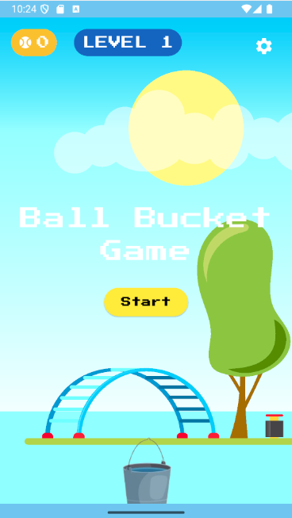
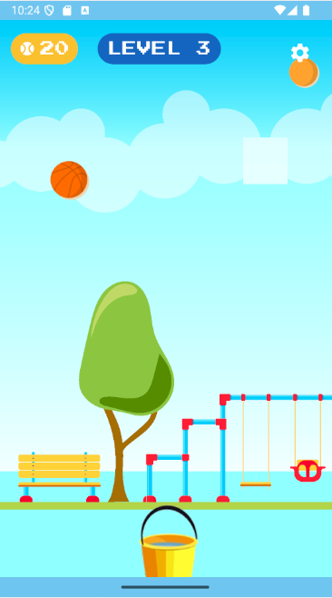
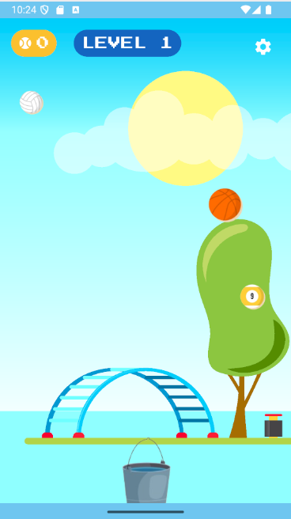

# Ball and Bucket Game

A fun and interactive Flutter game where you match colored balls with buckets. This project demonstrates Flutter's animation, gesture handling, and asset management capabilities.

## Project Structure

```
Exercise_3/
├── android/               # Android platform files
├── ios/                   # iOS platform files
├── lib/
│   ├── main.dart          # Main application entry point
│   └── assets/
│       ├── background.svg # SVG background for the game
│       ├── balls/         # Ball images (1.png, 2.png, ...)
│       └── buckets/       # Bucket images (1.png, 2.png, ...)
├── test/
│   └── widget_test.dart   # Example widget test
├── web/                   # Web platform files (for Flutter web)
│   ├── favicon.png
│   ├── index.html
│   ├── manifest.json
│   └── icons/
├── pubspec.yaml           # Project dependencies and assets
├── pubspec.lock           # Locked dependencies
├── analysis_options.yaml  # Linting rules
└── README.md              # Project documentation
```

## Configuration & Setup

1. **Install Flutter:**
   - Follow the [Flutter installation guide](https://docs.flutter.dev/get-started/install) for your OS.

2. **Get Dependencies:**
   - Open a terminal in the project directory and run:
     ```
     flutter pub get
     ```

3. **Run the App:**
   - For web (Chrome):
     ```
     flutter run -d chrome
     ```
   - For Android/iOS:
     - Connect your device or start an emulator/simulator.
     - Run:
       ```
       flutter run
       ```

## Gameplay & UI

- **Drag the Bucket:** Use your finger (mobile) or mouse (web) to drag the bucket horizontally at the bottom of the screen. The bucket's movement is smoothly animated and restricted within the screen bounds.
- **Level-based Buckets:** The bucket image updates with each level, using `lib/assets/buckets/{level}.png`. The level variable is clamped to the available bucket images.
- **Score Display:** A score indicator with a baseball icon appears at the top left, styled with a yellow background and rounded corners.
- **Animated Elements:** The game uses Flutter's `AnimatedPositioned` for smooth bucket movement and other UI transitions.

## Screenshots

To showcase the game UI and features, add your screenshots to the `screenshots/` folder in the main project directory. Reference them here using markdown:

- **Main Gameplay Screen:**
  
- **Level Up Example:**
  
- **Score Display:**
  

## Notes
- Make sure your Flutter version is up to date for best compatibility.
- All assets (SVG, PNGs) are included in the `lib/assets/` directory and referenced in `pubspec.yaml`.

## GitHub Repository

You can find the source code and latest updates on GitHub:

[https://github.com/antonyjm462/Exercise_3](https://github.com/antonyjm462/Exercise_3.git)